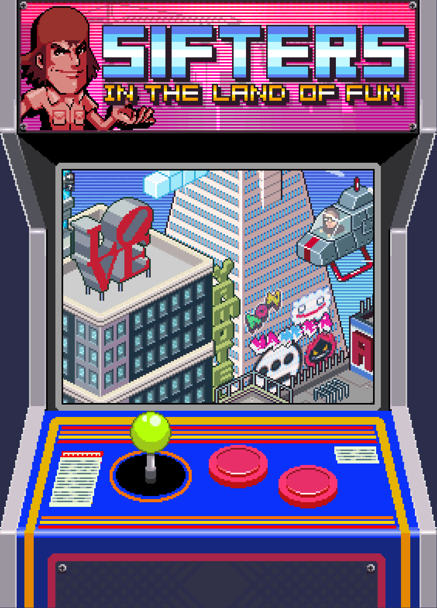

# Sifters in the Land of Fun

**Insert coin to win!**

**[https://sifters.app](https://sifters.app)**

## About

_Sifters in the Land of Fun_ is an original pixel art game from San Francisco-based musician and artist, [Yameen](https://yameenmusic.com).

It was originally released in 2011 to promote the launch of the album,
_[Never Knows Encore](https://yameenmusic.com/blog/category/never-knows-encore/)_.

In 2025, the game was completely rewritten, updating the code for modern devices, removing legacy and outdated tech stacks, incorporating quality-of-life improvements, and open-sourcing it under the MIT License and the Custom Creative Assets License.

## Gameplay

- Sift for hidden Philadelphia & San Francisco-themed hot spots by dragging, scrolling & clicking around.
- When you discover a hot spot, correctly name it for the win!
- Answer all the questions and win a prize.
- Avoid accessing the Cheat Sheet for maximum bonus.

## Features

- Large pixel art map of iconic Philadelphia and San Francisco landmarks
- Music player with original soundtrack
- Scoring system
- Leaderboard
- Social sharing
- Secret codes & screens
- Prizes

## Getting Started

`npm install`

### Development

`npm run dev`

### Production

`npm run build`

### Production Preview

`npm run serve`

## Development History

### `v2.0` - 2025

- Rewritten in modern JavaScript (ES6) with a class-based refactor
- Open sourced under the MIT License & Custom Creative Assets License
- Available on mobile devices for the first time
- Removed jQuery
- Removed PHP
- Removes legacy Internet Explorer support & hacks
- Added Vite for bundling
- Added a `package.json` configuration file & refactored the build & development process
- Improved project structure and folder organization
- Removed social sharing plug-ins (Twitter "Tweet" button & Facebook "Like" button), reducing file size and increasing performance

#### Quality of life improvements

- Increased the variety of answer options to broaden the acceptance criteria of the game
- Additional secret codes added
- Expanded keyboard shortcuts and accessibility features
- Added trackpad & mouse scrolling to the map, in addition to dragging
- Increased font sizes for legibility & modern high resolution displays

### `v1.0` - 2011

The original _Sifters in the Land of Fun_ launched in 2011 with a tech stack to match its era:

- PHP
- jQuery
- HTML5
- CSS3
- JavaScript

The game's original URL was `sifters.in`, which, with the help of a redirect, resolved to `sifters.in/the-land-of-fun/`.

#### Development Insights

Using PHP and device detection, the game provided a non-interactive experience for touch-enabled mobile devices of the era (iPhone 4S, Samsung Galaxy S II, etc.), informing players to check out the game on a desktop browser.

This was in large part due to the small screen sizes of phones, as well as challenges with device compatability and browser support.

Otherwise, desktop users were redirected to the game's landing page.

#### Internet Explorer Hacks

Several hacks—mostly in support of transparent PNGs—were used to provide compatibility for Internet Explorer 11, a browser that was frustratingly still in use at the time.

Conveniently, these hacks were served only to Internet Explorer users through well-documented browser detection methods, providing a quicker loading experience for the majority of users.

## Licensing

This project uses dual licensing:

- All code is available under the [MIT License](CODE_LICENSE.md)
- All artwork, sounds, and creative assets are protected under a [Custom License](ASSETS_LICENSE.md) - All rights reserved

Please respect the licensing terms when using or sharing this project.

### Attribution Requirements

- **For code (MIT License)**: Include the full MIT license text with its copyright notice in your project
- **For creative assets (Custom License)**: Do not extract or redistribute. If displaying assets as part of using the application code, provide visible attribution to Yameen as creator

For complete details, see the [LICENSE.md](LICENSE.md) file.

## Credits

- Original game concept & programming by Yameen
- Title based on a concept by Benny Brows
- Inspired by the Flash game "Arcade Aid" by 42 Entertainment
- Original pixel art by [Army of Trolls](http://www.armyoftrolls.co.uk)
- Original music by Yameen & [Mark de Clive-Lowe](https://www.mdcl.tv)
- Special thanks to [Pixelrevision](http://pixelrevision.com/)
- GET BONUS! DJ mix by [DJ Icewater](https://soundcloud.com/dj-icewater)
